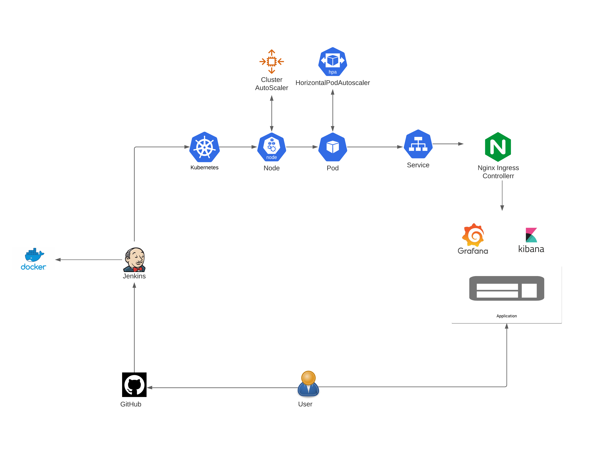

# Weather-Alert-API

## Objective
Microservices based REST APIs deployed on Kubernetes cluster using Helm Charts via Jenkins CI/CD pipeline

#### Link to Project Organization:  <a href="https://github.com/agrawal-nar-Advance-Cloud">https://github.com/agrawal-nar-Advance-Cloud</a>

### Maintainer
<table>
    <thead>
      <tr>
        <th>Name</th>
        <th>NUID</th>
      </tr>
    </thead>
    <tbody>
        <tr>
            <td>Naresh Agrawal</td>
            <td>001054600</td>
        </tr>
    </tbody>
</table>

### Technology Stack
* AWS
* Kubernetes
* Docker
* Ansible
* Jenkins
* Java

### Prerequisites
* AWS CLI
* Kubectl
* Docker
* Ansible
* JDK


### Architecture


### Deployment Instructions
* First create Infrastructure
```
$ cd K8s
```
* Set up Jenkins server
```
$ cd jenkins
```
* Deploy Webapp-backend
```
$ cd webapp-backend
```
* Deploy Poller
```
$ cd poller
```
* Deploy Notifier
```
$ cd notifier
```
* Deploy App-prereq(EFK, Prometheus, Grafana, Nginx, Kafka)
```
$ cd app-prereq-helm-charts
```

#### Detailed README will find in respective folders
